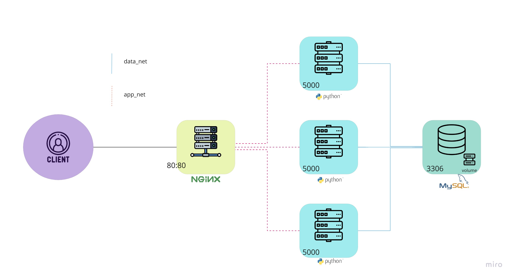

Chat App 2.0
===

#### architecture:

Chat App 2.0 is a web application that allows users to chat in real time. It is built using the Flask web framework, MySQL database and Docker containers. 

#### Features: 
- Create secure chat rooms
- Send and receive messages in real-time 
- Connect to other users in the same chat room 
- Customize messages with time stamps 

#### Installation: 
1. Clone the repository 
2. Run docker-compose build to build the application 
3. Run docker-compose up to start the application 
4. Access the application at localhost:80

#### Usage: 
1. Create a chat room by visiting localhost:80/chat/<room_name>
2. Invite your friends to join the same chat room 
3. Send and receive messages within the chat room 

#### Limitations: 
- Limited to chat rooms with up to 10 users 
- No authentication or authorization for users 
- No support for file sharing 

Contributing: 
Contributions are welcome! Please feel free to submit a pull request or open an issue. 
